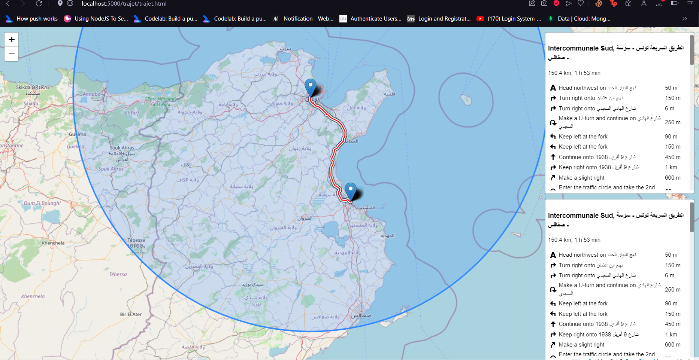

# 🗺️ Trajet Map

## Overview

Trajet Map is a web application designed to visualize and manage routes and trips. It provides an intuitive interface for creating, editing, and viewing routes on an interactive map. This project leverages modern web technologies to deliver a seamless user experience.

## Features

- 🛤️ **Route Creation:** Easily create new routes by specifying start and end points.
- ✏️ **Route Editing:** Modify existing routes with simple drag-and-drop functionality.
- 🗺️ **Interactive Map:** View and interact with routes on a dynamic map interface.
- 🔗 **API Integration:** Integrate with external services for additional route data and functionalities.

## Technologies

- **Frontend:**
  - 🗺️ Leaflet: For rendering interactive maps.
  - 🔗 Axios: For making HTTP requests to the backend API.

## Screenshots

### Route Creation

